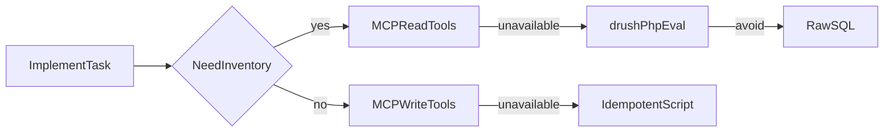

# MCP tooling guide for Spec Kit Drupal implement

## Tool selection hierarchy

When implementing or debugging a Drupal feature:

1. **MCP read tools** — inventory (menus, content types, config diff) when exposed in Cursor
2. **MCP write tools** — create/update entities (`[SB]` site-building tasks)
3. **`drush php:eval`** — entity API queries when MCP read tools unavailable
4. **Idempotent PHP scripts** — `scripts/setup-*-site.php`, `scripts/seed-*.php`
5. **Raw SQL** — last resort only; prefer entity API



## Cursor MCP vs contrib mcp_tools

The project configures `scope: read,write` in `drupal-config.yml`, but Cursor may
only expose a **subset** of tools (often write-heavy). Read tools such as
`mcp_tools_get_menus`, `mcp_tools_get_menu_tree`, and `mcp_structure_list_content_types`
exist in contrib but may not appear until:

1. `/admin/config/services/mcp-tools` → **Development** preset enabled
2. Cursor MCP server reloaded
3. Submodule enabled (see `mcp_tools.submodules` in config)

Run `.specify/extensions/drupal/scripts/bash/verify-mcp-tools.sh` to list
available tools and warn when expected read tools are missing.

## Approved fallbacks when MCP read is missing

| Task | Preferred fallback |
|------|-------------------|
| List menu links | `drush php:eval` + `menu_link_content` storage |
| Count content | `drush php:eval` + entity query |
| Block placements | `drush php:eval` + `block` storage |
| Config diff | `drush config:status` or `mcp_config_changes` |

**Do not use raw SQL** unless entity API cannot answer the question.

## Idempotent site-building scripts

All `scripts/setup-*.php` and `scripts/seed-*.php` MUST:

- Check-before-create (see `templates/setup-site.php.template`)
- Never add custom "Home" when `standard.front_page` exists in main menu
- Deduplicate by `title|uri` when repairing repeated runs
- Print completion message; caller runs `drush cr` + `verify-quality.sh`

## After setup

```bash
ddev drush php:script scripts/seed-<feature>-content.php
ddev drush cr
.specify/extensions/drupal/scripts/bash/verify-quality.sh specs/<feature>
```

## References

- `commands/speckit.drupal.setup-mcp-tools.md`
- `templates/mcp-tools-workflow.md`
- Feature `postmortem.md` when debugging production-like local issues
